#Project 3 - Physical Therapy App
[Heroku Link] https://github.com/GA-Project3/Physical-Therapy-App

##Scope

####Goal
Allow the user and the physician to communicate and interact online. Physician will be able to assign exercises to patients undergoing physical therapy via digital media (pictures/gif, videos, descriptions).

##User Stories

There are two users: patient and doctor.

#####Patient
The patient will be able to log in/sign up,  view the doctors, choose a doctor, view the list of exercises prescribed by the doctor, and view the overall exercise index page
 
#####Doctors
The physician will be able to log in/sign up, to view the patient profile, assign/remove the exercises to the patient

We'll have three models: patients,  doctors and exercises. The patient and exercises are connected by a joint table

##Technologies Used
* Upload-Care
* Validation, Authorization, Authentication
* JS/Jquery for front-end
* AJAX

##Planning
[Trello] (https://trello.com/b/2hUBMDlJ)

[Schedule/Milestones] (https://docs.google.com/spreadsheets/d/1v_VcVBdGkPDtkP9yZEItrfRznMJE9yYMZdebbxAq5Pc/edit#gid=0)

Entity Relationship Diagram

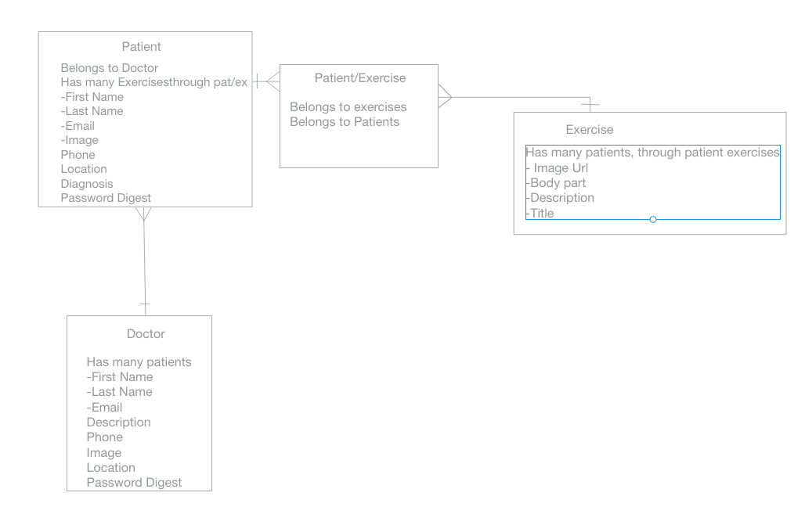

Wireframes

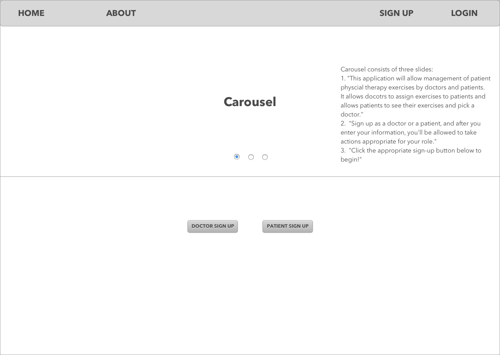
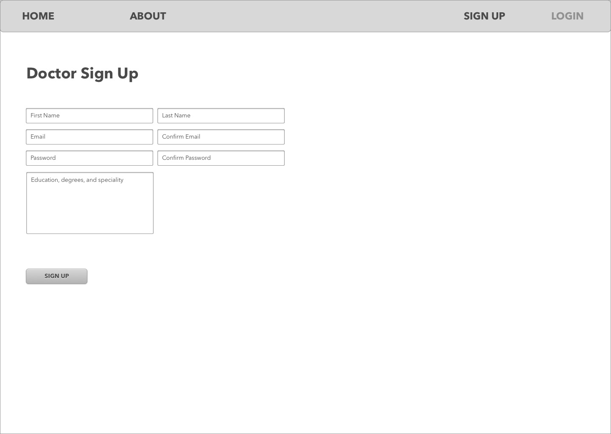
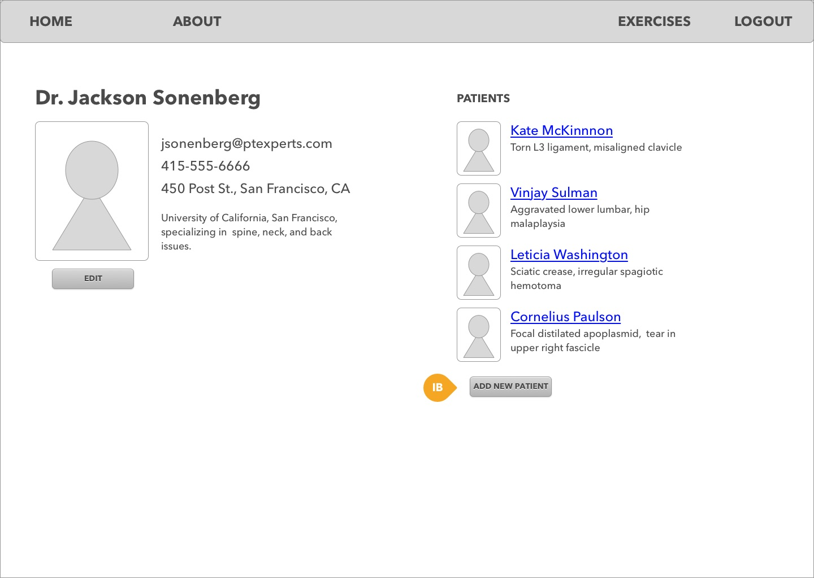
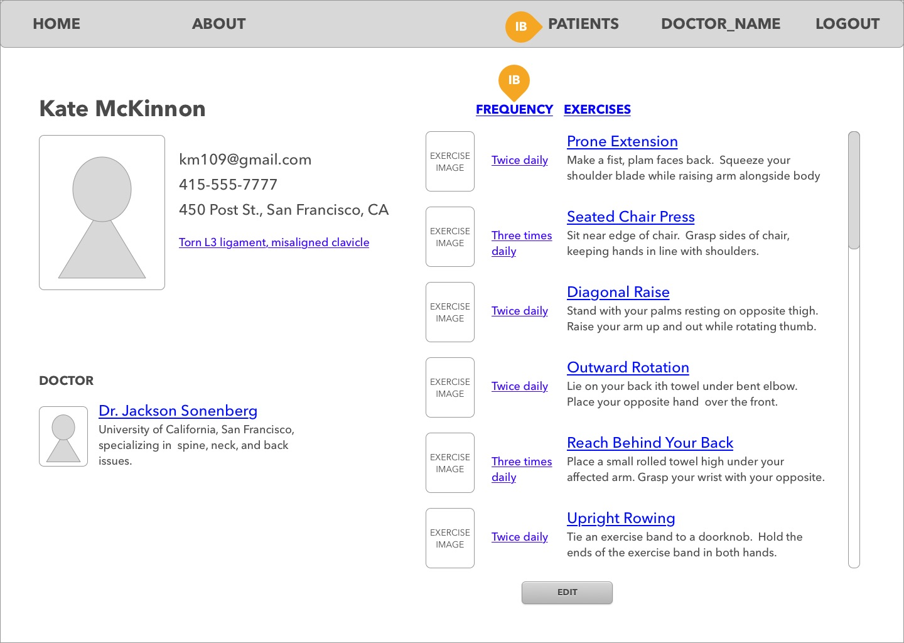
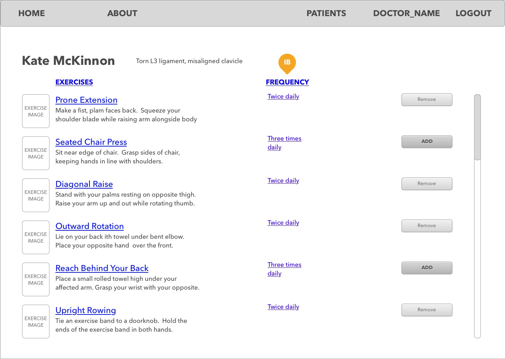
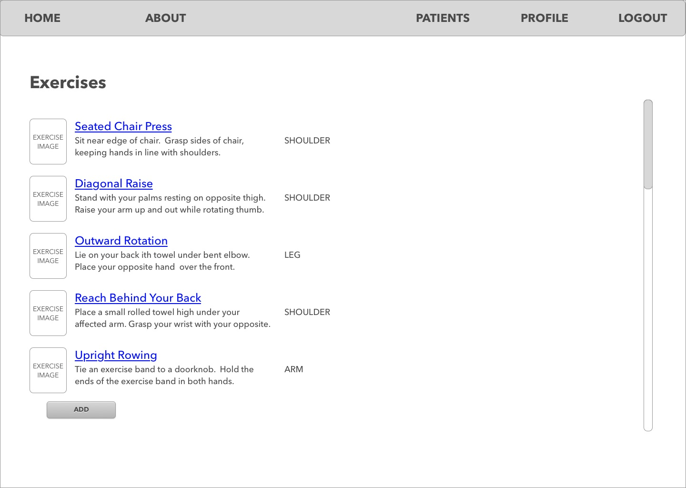
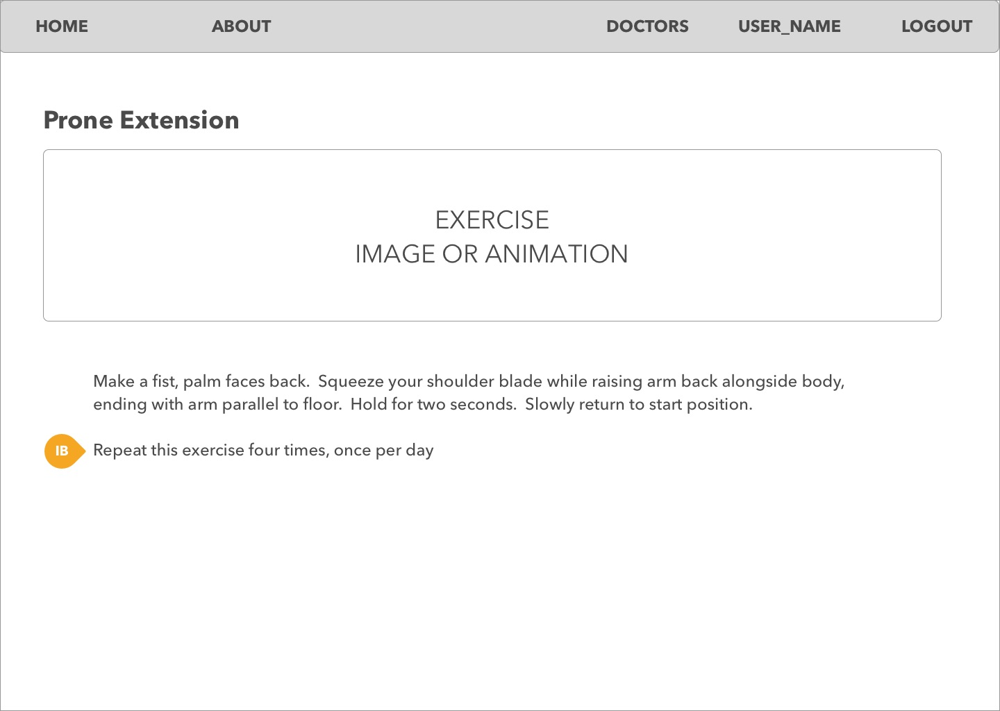
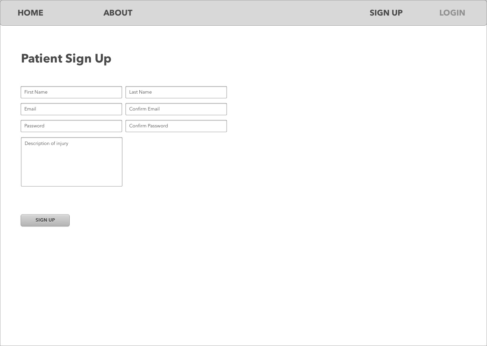
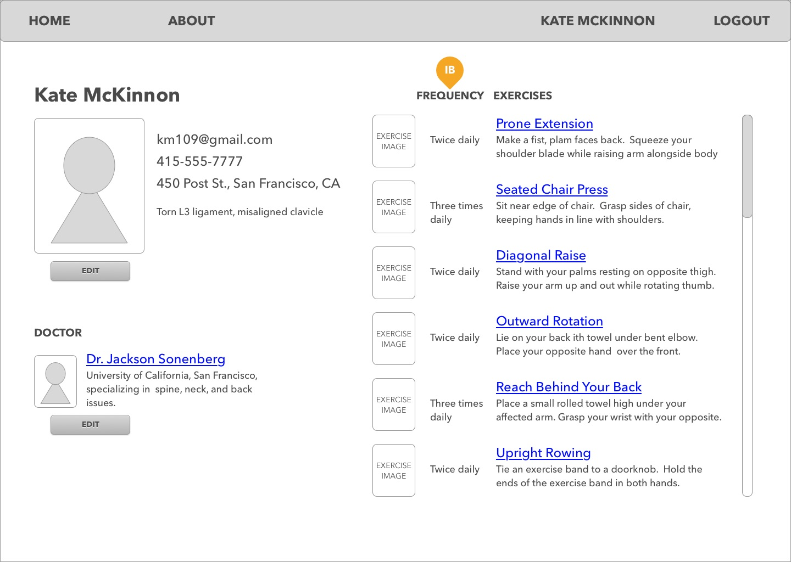
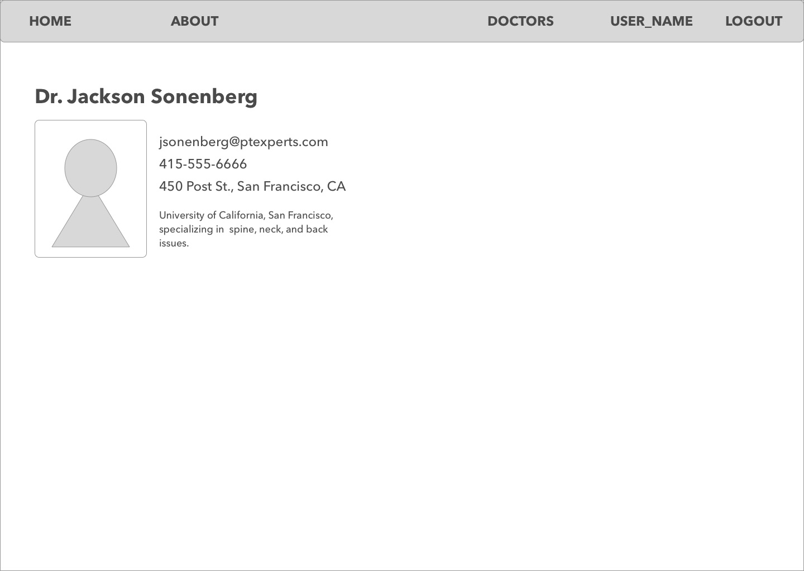
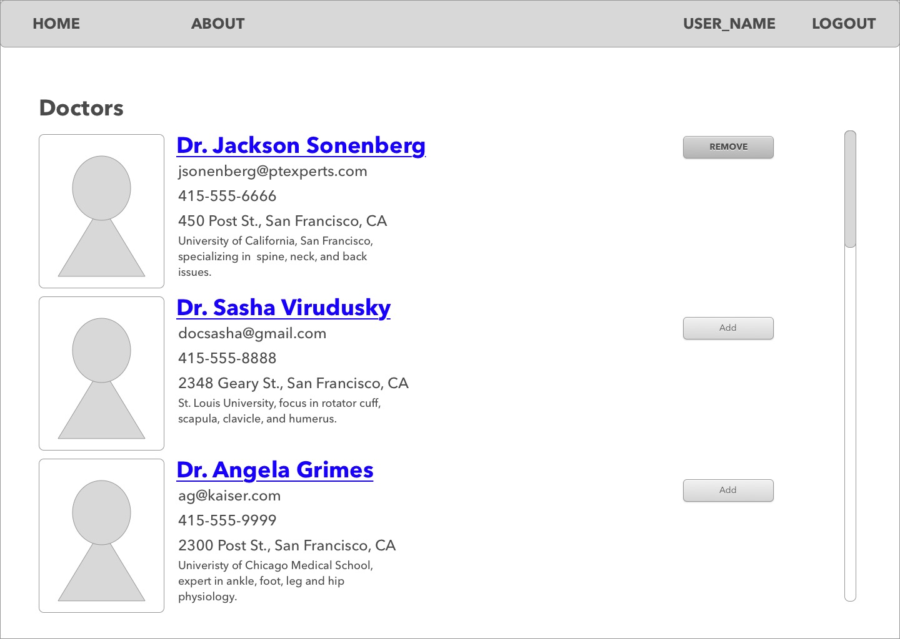
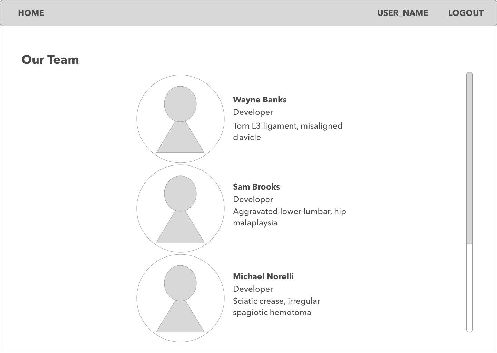
.jpg)

